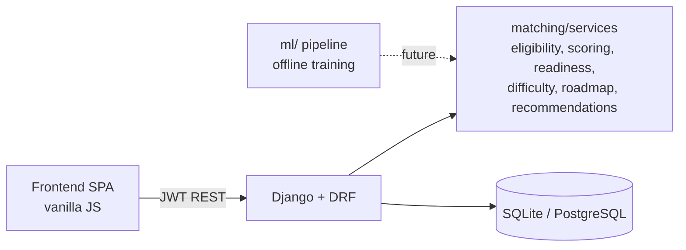
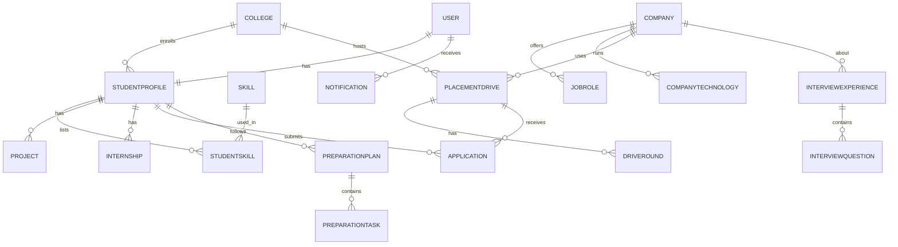

# DriveIQ architecture

## Problem
Placement information is scattered (WhatsApp, notices, spreadsheets). Students cannot quickly see eligibility,
fit, preparation needs, past experiences or offer terms for a visiting company.

## Solution
One platform combining company profile + drive data + student profile -> eligibility, explainable match,
readiness, roadmap, difficulty, offer decoding and red-flag information.

## System

## Apps (backend)
| App | Responsibility |
|---|---|
| users | custom User (role), StudentProfile, skills, projects, internships, auth, dashboard |
| companies | Company 360, technologies, roles, skills, saved companies |
| drives | PlacementDrive, rounds, applications, new-drive notification signal |
| matching | pure-Python services + eligibility / match / compare / recommendation endpoints |
| preparation | readiness endpoint, saved roadmap plans and tasks |
| experiences | student submissions + admin moderation |
| offers | Offer decoder and red-flag detector |
| notifications | in-app notifications, `send_reminders` command |

## ER diagram (core)

Design notes: offer terms live on `PlacementDrive` (NULL = *not specified*, never zero), so a separate
Offer/OfferComponent table was not needed yet. Recommendations are computed on the fly rather than stored.

## API (all under /api/, JWT required except register/login)
| Endpoint | Purpose |
|---|---|
| POST auth/register, auth/login, auth/refresh; GET auth/me | authentication |
| GET/PATCH students/profile; CRUD students/skills, projects, internships, certifications; GET students/dashboard, colleges | profile |
| CRUD companies/ (write = admin), POST/DELETE companies/{id}/save/, companies/skills/, companies/roles/ | companies |
| CRUD drives/ (write = admin), GET drives/{id}/difficulty/, POST drives/{id}/apply/, GET drives/applications/ | drives |
| GET eligibility/{drive_id}/ | eligibility with reasons |
| GET matching/{drive_id}/, GET matching/compare/?drives=1,2 | match + factors, comparison |
| GET recommendations/ | eligible drives ranked by match |
| GET preparation/readiness/?drive=, GET/POST preparation/roadmap/{drive_id}/, PATCH preparation/tasks/{id}/ | preparation |
| GET/POST experiences/, GET experiences/pending/, POST experiences/{id}/moderate/ | experiences |
| POST offers/decode/, GET offers/drive/{id}/ | offer intelligence |
| GET notifications/, POST notifications/{id}/read/, read-all/, GET unread-count/ | notifications |

## Methodology (rule-based, explainable)
- **Eligibility**: hard checks (CGPA, backlogs, branch, graduation year). Missing profile data is "cannot verify", never assumed OK. Skills are advisory.
- **Match score**: weighted factors (eligibility 30, skills 30, role 15, location 5, readiness 20). Factors without data are excluded and weights renormalised. Shows profile alignment, not selection odds.
- **Readiness**: self-reported levels averaged over areas tested by the drive's rounds; <50 Needs Preparation, <80 Nearly Ready, else Ready.
- **Difficulty**: average of available factors (round count, per-round difficulty, approved experiences, registrations per opening). No data -> "Insufficient data".
- **Offer decoder**: shows only stored components; estimates exist only when the user supplies an assumption and are labelled ESTIMATE.

## Limitations
- Branch matching is exact text (CSE vs "Computer Science" differ); normalise via admin.
- Skill levels are self-reported. Difficulty and competition depend on admin/student-entered data.
- Company/drive data must be entered by admins; DriveIQ does not scrape or invent it.
- No dataset or ML model is shipped (see ml/README.md).

## Future enhancements
Email/push notifications, resume parsing, ML readiness model on real data, branch aliases, React/Next.js frontend,
PostgreSQL deployment, rate-limit tuning, audit log for moderation.
